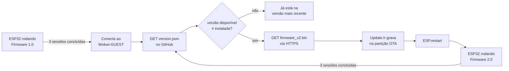

# Projeto Motiva | Atualização Remota de Firmware (OTA)

**S2-CP02 · Edge Computing · FIAP · Turma 2CCPW**
Professor: Marcelo Fernando Morgantini

Um ESP32 simulado no Wokwi monitora a altura da vegetação na beira da rodovia. Ele começa rodando o Firmware 1.0, consulta um manifesto de versão neste repositório, baixa o Firmware 2.0 por HTTPS, grava a nova versão por OTA (Over-The-Air), reinicia e passa a rodar a versão nova, sem que ninguém precise ir até o dispositivo.

## Integrantes

| Nome | RM |
| ---- | -- |
| Arthur | RM562181 |
| Isabelle | RM566464 |
| Carol | RM564651 |
| Léo | RM563663 |
| Manoella | RM564469 |
| Júlia | RM565010 |

## Links

- **Simulação no Wokwi:** `https://wokwi.com/projects/475445310604855297`
- **Manifesto:** [`version.json`](https://raw.githubusercontent.com/ArthurReisBS/CP02EDGE/main/version.json)
- **Binário do Firmware 2.0:** [`firmware_v2.bin`](https://raw.githubusercontent.com/ArthurReisBS/CP02EDGE/main/firmware_v2.bin)

## Estrutura do repositório

| Arquivo | O que é |
| ------- | ------- |
| `firmware_v1.ino` | Firmware 1.0: leituras, média e LED azul. É a versão que roda antes da atualização |
| `firmware_v2.ino` | Firmware 2.0: acrescenta ordenação, mediana, histerese e LED verde/vermelho |
| `firmware_v2.bin` | Binário compilado a partir do firmware_v2.ino deste repositório. |
| `version.json` | Manifesto: versão disponível e URL raw do binário |
| `diagram.json` | Circuito do Wokwi: ESP32 DevKit V1 + LED RGB + 3 resistores |
| `libraries.txt` | Bibliotecas que o Wokwi instala: ArduinoJson |
| `firmware_teste_v2/` | Sketch mínimo que só imprime "SOU A VERSAO 2.0", usado para testar o OTA antes do firmware final ficar pronto |

## Arquitetura



O manifesto guarda apenas dois campos:

```json
{
  "version": "2.0",
  "url": "https://raw.githubusercontent.com/ArthurReisBS/CP02EDGE/main/firmware_v2.bin"
}
```

A URL precisa ser o link raw. O link comum do GitHub devolve uma página HTML, e o ESP32 tentaria gravar esse HTML como firmware.

### Circuito

| LED RGB (catodo comum) | Pino do ESP32 | Resistor |
| ---------------------- | ------------- | -------- |
| R | GPIO 25 | 220 Ω |
| G | GPIO 26 | 220 Ω |
| B | GPIO 27 | 220 Ω |
| COM | GND | — |

Não há sensor físico. As leituras são números pseudoaleatórios inteiros de 10 a 20 cm, com semente vinda de `esp_random()`.

## Firmware 1.0 × Firmware 2.0

| | Firmware 1.0 | Firmware 2.0 |
| - | ------------ | ------------ |
| Leituras | 5 por sessão, uma a cada 2 s, guardadas em vetor | igual |
| Sessão | nova a cada 48 s contados do início da anterior | igual |
| Cálculo | média | média + cópia ordenada + mediana |
| Estado | — | histerese sobre a mediana: NORMAL / ALERTA |
| LED | azul | verde (NORMAL) · vermelho (ALERTA) |
| OTA | consulta o manifesto após 3 sessões e atualiza | consulta após 3 sessões e informa que já está na versão mais recente |

### Temporização sem delay

As sessões são agendadas com millis(). O instante da próxima sessão é somado a partir do agendamento anterior (proximaSessaoMs += 48000), e não do fim da 5ª leitura. Por isso a sessão seguinte começa 48 s depois do início da anterior, e não 56 s (8 s de leituras + 48 s).

### Média × mediana

- **Média:** soma das 5 leituras dividida por 5. Uma única leitura errada (um galho passando, por exemplo) puxa o valor inteiro.
- **Mediana:** o valor do meio depois de ordenar, ou seja, o 3º de 5. Um valor extremo isolado não muda a mediana, e por isso é ela que decide o estado.

A ordenação é um *insertion sort* implementado no próprio código (`ordenarCopia`), feito sobre uma cópia. O vetor original continua na ordem de chegada e aparece assim no Serial.

### Histerese

| Mediana | Estado resultante |
| ------- | ----------------- |
| `>= 16` cm | ALERTA (LED vermelho) |
| `<= 14` cm | NORMAL (LED verde) |
| `15` cm | mantém o estado anterior |

Com um limite único (por exemplo, 15 cm), uma vegetação oscilando em torno desse valor faria o estado trocar a cada sessão. A faixa morta entre 14 e 16 evita essa oscilação: para sair de ALERTA a mediana precisa cair até 14, e para entrar precisa subir até 16.

## Tratamento de erros

Cada falha gera uma mensagem própria no Serial:

| Situação | Onde é detectada | Mensagem |
| -------- | ---------------- | -------- |
| Sem Wi-Fi | `conectarWiFi()` / `consultarManifestoOTA()` | `Erro: Nao foi possivel ligar ao Wi-Fi.` |
| Manifesto inacessível | `consultarManifestoOTA()` (HTTP ≠ 200) | `Erro: O manifesto nao pode ser acedido. Codigo HTTP: …` |
| Manifesto inválido | `deserializeJson()` | `Erro: Falha ao interpretar o ficheiro version.json.` |
| Já é a versão mais recente | comparação de versão | `A versao instalada ja e a mais recente.` |
| `.bin` não baixou | `executarOTA()` → `OTA_DOWNLOAD_FALHOU` | `Erro: Nao foi possivel descarregar o ficheiro .bin.` |
| Sem espaço na partição | `Update.begin()` → `OTA_SEM_ESPACO` | `Erro: Espaco insuficiente na particao OTA.` |
| Gravação OTA falhou | `Update.writeStream()` / `Update.end()` → `OTA_GRAVACAO_FALHOU` | `Erro: Falha ao gravar o firmware.` + `Update.errorString()` |

Validação dupla da gravação: o número de bytes gravados precisa ser igual ao tamanho informado pelo servidor, e Update.end(true) precisa confirmar a imagem. Se qualquer uma das duas falhar, o ESP32 não reinicia e continua rodando a versão atual.

## Modo de teste (Firmware 2.0)

Com números aleatórios não dá para garantir que uma sessão caia exatamente na faixa da histerese. Por isso, no firmware_v2.ino, `MODO_TESTE_FIXO = true` troca o `random()` por um dos vetores abaixo, escolhido em `TESTE_ATIVO`:

| `TESTE_ATIVO` | Vetor | Ordenado | Mediana | Efeito |
| ------------- | ----- | -------- | ------- | ------ |
| 0 | 18 17 16 19 20 | 16 17 18 19 20 | 18 | ALERTA |
| 1 | 15 14 15 16 15 | 14 15 15 15 16 | 15 | mantém o estado |
| 2 | 12 13 14 10 14 | 10 12 13 14 14 | 13 | NORMAL |

O firmware_v2.bin publicado foi gerado com `MODO_TESTE_FIXO = false`, que é o comportamento normal.

## Como executar

### Simulação no Wokwi

1. Abrir o link público do projeto (seção Links).
2. Iniciar a simulação. O Serial mostra `MONITORAMENTO DE VEGETACAO - FW 1.0` e o LED acende em azul.
3. Aguardar 3 sessões. A 3ª termina em cerca de 1 min 44 s (sessões iniciando em 0 s, 48 s e 96 s, mais 8 s de leituras).
4. O ESP32 conecta ao `Wokwi-GUEST`, lê o manifesto, baixa o .bin, mostra o progresso da gravação e reinicia.
5. Depois do reboot, o Serial mostra `MONITORAMENTO DE VEGETACAO - FW 2.0` e o LED passa a verde ou vermelho.
6. Após mais 3 sessões, o Firmware 2.0 consulta o manifesto de novo e informa que já está na versão mais recente.

### Gerar um novo firmware_v2.bin

Se o firmware_v2.ino mudar, o binário precisa ser gerado de novo, senão o repositório deixa de ser consistente:

1. Compilar o firmware_v2.ino para ESP32 Dev Module (Arduino IDE: *Sketch → Export Compiled Binary*; Wokwi: F1 → *Download compiled firmware*).
2. Renomear o `.bin` da aplicação para `firmware_v2.bin`. É o arquivo `firmware_v2.ino.bin`, e não o `*.merged.bin` nem o `bootloader.bin`.
3. Substituir o arquivo na raiz do repositório, fazer commit e push.
4. Só alterar `"version"` no `version.json` se a versão realmente mudar.


## Bibliotecas

| Biblioteca | Origem | Uso |
| ---------- | ------ | --- |
| `WiFi.h` | core ESP32 | conexão com a rede `Wokwi-GUEST` |
| `HTTPClient.h` + `WiFiClientSecure.h` | core ESP32 | requisições HTTPS ao GitHub (`setInsecure()`: o certificado não é verificado, o que é aceitável em simulação, mas não em produção) |
| `Update.h` | core ESP32 | gravação do novo firmware na partição OTA inativa e troca da partição de boot |
| `ArduinoJson` | externa (`libraries.txt`) | leitura dos campos version e url do manifesto |

## Por que OTA importa em campo

Os sensores do projeto Motiva ficariam espalhados ao longo de rodovias. Sem OTA, corrigir um bug ou mudar um limiar exigiria mandar alguém até cada poste, com custo de tempo, força de trabalho, deslocamento e risco na pista. Com OTA, uma versão publicada no repositório chega a todos os dispositivos na próxima consulta ao manifesto. Como a gravação acontece na partição inativa e só vira a partição de boot depois de validada, uma atualização que falha no meio não inutiliza o dispositivo.
